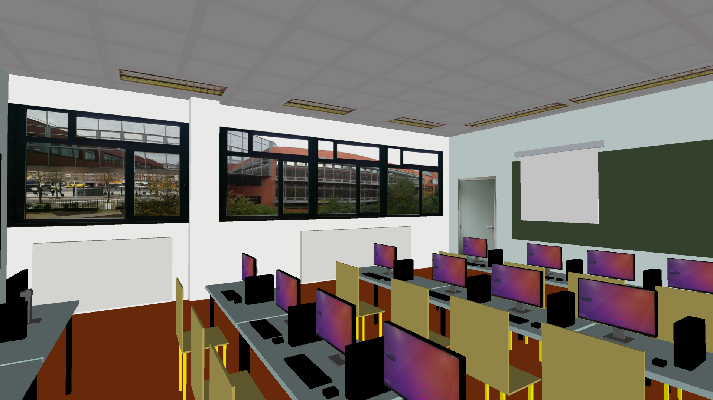

# Projet d'infographie Modelisation de la salle A106

- Année : M1 iWOCS
- Matière: Infographie
- Langage: Processing

## Auteur(s)

|Nom|Prénom|login|email|
|--|--|--|--|
| *KOUTO* | *Dosseh* | *dosseh* | *dossehkouto@yahoo.fr* |

## Travail à réaliser

Le projet consiste à utiliser l'intégralité des éléments que nous avons évoqués en cours afin de créer une scène qui représentera la salle de TP A106. Nous devons placer une camera dans la scène et permettre le déplacement dans celle-ci. Nous devons placer plusieurs lumières dans la scène. Nous devons  modéliser les objets de la salle mais des déformations de cubes sont tout à fait suffisantes (il ne nous est pas demandé de modéliser des cylindres, etc.). Des textures doivent être appliquées à certains objets.

 ####  Aperçue de la salle vue de l’intérieur .
 

 #### Fonctionnement du programme :
 
   _Caméra_
 
- La touche UP ou 'w' :  Le maintient de cette touche sert à allez de l'avant. 
- La touche DOWN ou 's' : Le maintient de cette touche sert  à reculé. 
-  La touche LEFT ou 'a' :  Le maintient de cette touche sert à allez de la gauche . 
-  La touche RIGHT ou 'd' :  Le maintient de cette touche sert à allez de la droite. 
- Le clic gauche :  Le maintient de ce clic tout en tournant légèrement la souris vers une direction sert à orienté la vue de la salle vers cette direction.

		On peut  facilement explorer tout endroit de la salle maintenant.
		
  _Lumière_
  
- La touche ESPACE : Sert a allumé ou éteindre la Lumière. 
	Restez de préférence a l’intérieur de la salle pour bien observé la différence entre le mode normal (jour) et le mode lumière (nuit). 
	Il est bon a savoir aussi qu'en activant le mode lumiere on suppose qu'il est nuit et qu'on veut éclairer la salle. Du coups, l'exterieur de la porte d'entrée peut parfoit ne pas etre éclairé et c'est loqique. J'ai appliqué la lumiere juste au niveau des fenetres et du plafond comme peut l'observer en ettant dans la salle.

- La touche ALT : Sert a passé en mode Alarme incendie. 
	Vous allez observé le changement alterné du mode lumière et du mode normale sous forme de clignotement ( (Genre sirène ou blink). Pour quitter ce mode il suffit juste d’appuyer sur n'importe quelle touche.
	
		La touche ESPACE fonctionne donc comme un interrupteur permettant d'allumé ou d'éteindre la lumière.

  _Autre mode_
- Le clic de souris (droit ou gauche) : Sert à déroulé ou enroulé le rideau projecteur.

- Concernant le coté extérieure de la fenêtre, je l'ai représenté en vitre fumée comme on peut l'observé depuis la salle face à la fenêtre de la salle A106. Autrement dire on ne peut pas voir l’intérieur de la salle depuis l’extérieur ou a partir d'une autre salle.

## 
### KOUTO Dosseh
### M1 IWOCS
### dossehkouto@yahoo.fr
